# seichiassist-downloader

[SeichiAssist](https://github.com/GiganticMinecraft/SeichiAssist/) の jar ファイルをダウンロードするためのソフトウェア

# 作成した経緯

前提として、整地鯖を 1.18 にアップデートすると同時に整地鯖自体を k8s([seichi_infra](https://github.com/GiganticMinecraft/seichi_infra)) 上に乗せることになった。
このとき、SeichiAssist のリリース(jar ファイルのバージョン)には以下 3 つの種類が必要だった。

- 本番環境用の安定版(master ブランチ)
- 検証環境用の開発版(develop ブランチ)
- プルリクエストごとの環境用の開発版(動的に指定される(PR にタグが付けられた)ブランチ)

これらのリリースを別々に取得できた上で、本番環境用の安定版は開発者がこの状態でリリースをするという意思表明を行う操作(develop ブランチから master ブランチへのマージ操作(正確には、GitHub Actions による操作))が行われたうえで安定版をリリースするという必要があった。これを解決するために、seichiassist-downloader を作成した。

# 他に検討した方法

## GitHub Releases と GitHub API、ShellScript を組み合わせる方法

1. GitHub Releases に登録するタグの命名規則を必要なバージョンの種類ごとに決める
2. 各ブランチにマージされたことをトリガーとして、GitHub Actions を使用し jar ファイルを GitHub Releases にアップロードする
3. 各 Minecraft Server の Pod の定義に、GitHub API を使用して命名規則に一致する最新の jar ファイルをダウンロードする Shell Script を定義する

### この方法を採用しなかった理由

この方法はとても手軽な方法だが、以下の理由から seichiassist-downloader を採用することにした

- 整地鯖で SeichiAssist を必要とする Minecraft Server すべてにこの Shell Script を配置し、実行する必要があること
- Minecraft Server が乗っている Pod が Crach loop back off 状態になった場合、再起動するたびに Shell Script が実行されるため、高頻度で GitHub API にアクセスすることになってしまうこと
- GitHub API の仕様上、Release の一覧を取得する API で取得できる数に制限があり、1 ページ分のリストで取得できない場合にリクエスト数が増えてしまうこと

# 仕組み

# 環境変数

| 環境変数名     | 例      |
| -------------- | ------- |
| HTTP_PORT      | 80      |
| STABLE_BRANCH  | master  |
| DEVELOP_BRANCH | develop |

# 各エンドポイントについて

各エンドポイントは [GitHub Pages に API 定義](https://giganticminecraft.github.io/seichiassist-downloader/)があるので参照してください。
